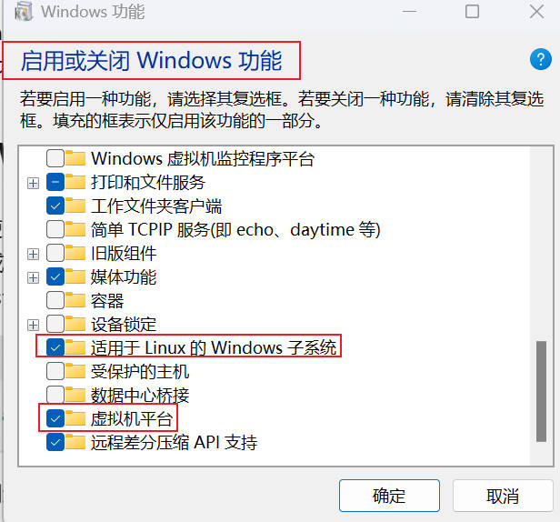
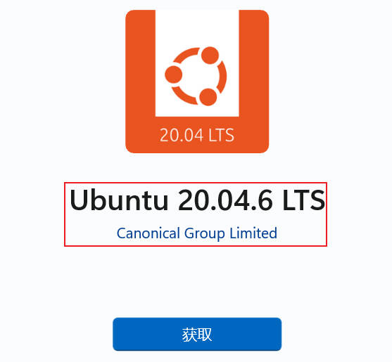
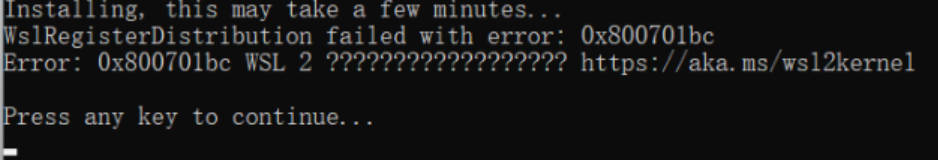
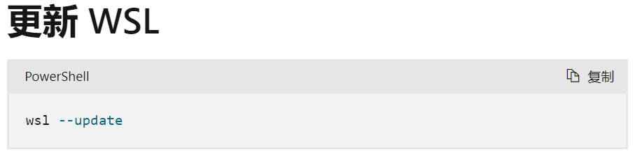
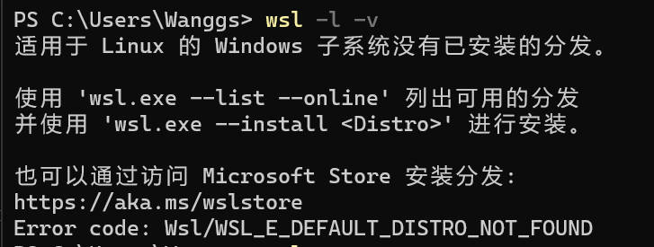
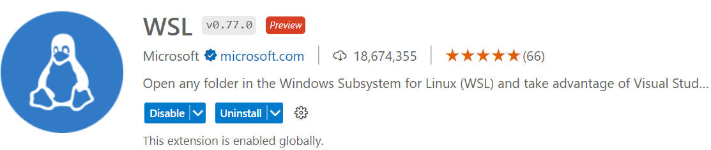
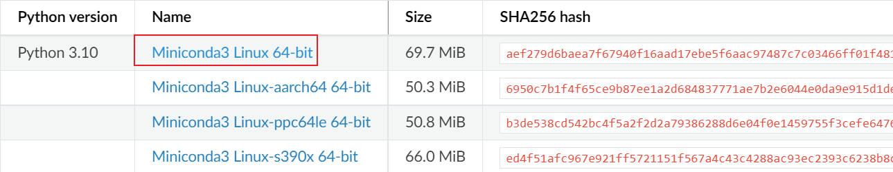
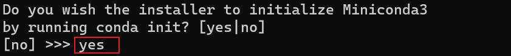

# Windows Subsystem for Linux

适用于 Linux 的 Windows 子系统：

[微软官方文档](https://learn.microsoft.com/zh-cn/windows/wsl/)

## 1.安装

**1.搜索打开：启用或关闭 Windows 功能**



选择上述两项，并进行重新启动。

**2.打开微软商店下载 Linux 发行版**


**输入 WSL，并选择版本**



**3.错误提示解决方法**

**错误1**



对 wsl 进行更新即可：`wsl --update`，然后重启。



**错误2**

[参考文章](https://zhuanlan.zhihu.com/p/612154391)

若提示没有已安装的分发，需点击 `Ubuntu` 进行安装即可。



## 2.使用

### 2.1 wsl+vsCode

输入：`wsl` 搜索拓展



### 2.2 Gym 配置

[参考教程](https://cloud.tencent.com/developer/article/1835263)

[Linux 环境按安装 Gym](https://www.jianshu.com/p/536d300a397e)

**前期安装 OpenAI/gym 的依赖**

```bash
sudo apt-get install -y python-numpy python-dev cmake zlib1g-dev libjpeg-dev xvfb ffmpeg xorg-dev python-opengl libboost-all-dev libsdl2-dev swig
```

#### 1.安装 miniconda

**建议切换到 VSCode 界面操作!!!**


[miniconda 官网](https://docs.conda.io/en/latest/miniconda.html#)



**建议直接使用默认的用户安装目录！！！**

```bash
#下载
sudo wget https://repo.anaconda.com/miniconda/Miniconda3-py310_23.3.1-0-Linux-x86_64.sh
#安装
sudo bash Miniconda3-py37_4.12.0-Linux-x86_64.sh
```




**更改安装路径的情况(不推荐)**

```bash
#下载
sudo wget https://repo.anaconda.com/miniconda/Miniconda3-py310_23.3.1-0-Linux-x86_64.sh
#安装
sudo bash Miniconda3-py37_4.12.0-Linux-x86_64.sh
#空格键翻页
#/opt/miniconda3
/usr/local/miniconda3
#/usr/local/src 是用户级的源码存放目录，(usr: unix system resource)

#手动配置安装路径
export PATH=/usr/local/miniconda3/bin:$PATH
#wq保存退出
source ~/.bashrc #重新载入文件
```

#### 2.更换阿里源

[阿里云镜像](https://developer.aliyun.com/mirror/anaconda?spm=a2c6h.13651102.0.0.5bfd1b11c4pvr9)

```bash
conda config --show-sources #查看源
conda config --remove-key channels #恢复默认源
conda config --remove channels defaults #删除默认源
```

#### 3.创建虚拟环境

重启电脑命令：`sudo reboot`

```bash
conda create -p E:\pythonwork\Jupyter\tensorflowenv38 python=3.8 
# 正式创建方法
conda create -n tfenv38 python=3.8
#激活
conda activate tfenv38
#退出
conda deactivate
conda remove --name <env name> --all
```

#### 4.安装 Gym

[Gym 历史说明](https://it.cha138.com/javascript/show-1976535.html)

[官方文档](https://gymnasium.farama.org/) || [Github 地址](https://github.com/Farama-Foundation/Gymnasium)

对于 gymnasium 我们只需要做两件事情：一个是初始化环境，另一个就是通过 step 函数不停地给环境做输入，然后观察对应的结果。

安装 gymnasium ：

```bash
# 采用其他源解决超时问题
-i http://pypi.douban.com/simple/ --trusted-host pypi.douban.com
# 一次性全部安装
pip install "gymnasium[all]"  #安装所有的依赖,容易出错
pip install gymnasium 
# 分别安装
pip install gymnasium[atari]
pip install gymnasium[classic-control]
pip install gymnasium[box2d]
```

传统安装方式 (不推荐)：

```bash
https://github.com/openai/gym.git
pip install -e '.[all]'
```

#### 5.测试案例

[Classic Control](https://gymnasium.farama.org/environments/classic_control/#classic-control)：Acrobat || Cart Pole || Mountain Car Continuous||Mountain Car || Pendulum

```bash
#pip install gymnasium[classic-control]
import gymnasium as gym
env = gym.make("CartPole-v1", render_mode="human")

observation, info = env.reset(seed=42)
for _ in range(1000):
    env.render()
    action = env.action_space.sample()
    observation, reward, terminated, truncated, info = env.step(action)

    if terminated or truncated:
        observation, info = env.reset()
env.close()
```

[Box2D](https://gymnasium.farama.org/environments/box2d/)：Bipedal Walker || Car Racing || Lunar Lander

```python
# pip install gymnasium[box2d] -i http://pypi.douban.com/simple/ --trusted-host pypi.douban.com
import gymnasium as gym
env = gym.make("LunarLander-v2", render_mode="human")
observation, info = env.reset(seed=42)
for _ in range(1000):
   action = env.action_space.sample()  # this is where you would insert your policy
   observation, reward, terminated, truncated, info = env.step(action)

   if terminated or truncated:
      observation, info = env.reset()
env.close()
```

### 2.3 TF和Gym配合

采用版本：

`gymnasium==0.26.1`

`tensorflow-cpu==2.6.`

```bash
pip install --upgrade gymnasium==0.26.1 -i http://pypi.douban.com/simple/ --trusted-host pypi.douban.com
pip install -U -i https://pypi.tuna.tsinghua.edu.cn/simple numpy==版本
# -U 是重装
pip install gymnasium -i http://pypi.douban.com/simple/ --trusted-host pypi.douban.com

pip check #检查冲突

pip install tensorflow==100 # 测试存在的版本
pip install tensorflow== # 另一种测试方法

pip install --upgrade tensorflow-cpu==2.6.0 -i http://pypi.douban.com/simple/ --trusted-host pypi.douban.com
pip install  tensorflow-cpu==2.8.4 -i http://pypi.douban.com/simple/ --trusted-host pypi.douban.com
```

#### pip 常见指令

Python软件包索引”（英语：Python Package Index，PyPI）

```bash
pip uninstall -r requirements.txt
pip install -r requirements.txt
pip freeze > requirements.txt
```

针对 pip 的超时问题和包冲突：

`pip --default-timeout=1688 install 库名称 -i http://pypi.douban.com/simple/ --trusted-host pypi.douban.com `

```bash
# 更新 pip 到最新的版本
python -m pip install --default-timeout=1688 --upgrade pip -i http://pypi.douban.com/simple/ --trusted-host pypi.douban.com #解决超时问题

pip check #检查

# 更新其他包
pip install --upgrade numpy==1.19.5 -i http://pypi.douban.com/simple/ --trusted-host pypi.douban.com
```

#### 版本周期

[参考文章：tensorflow 版本介绍](https://www.cnblogs.com/shuaishuaidefeizhu/p/11098310.html)

1. alpha版：**内部测试版**，给开发人员和 测试人员测试，用于解决存在的较多的 BUG 版本
2. beta版：**公开测试版**，主要是给“群组”用户和忠实用户测试用的，依然存较多 BUG，相对于 alpha版 更稳定些，此时仍可添加需求
3. rc版：即 Release Candidate（**候选版本**），正式发行的预览版
4. stable版：**稳定版**


