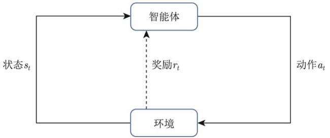
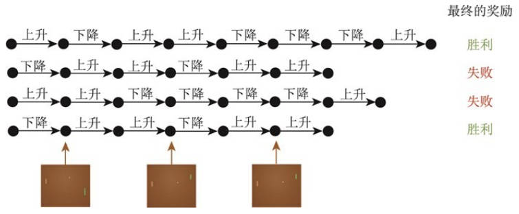
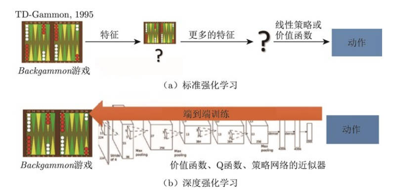
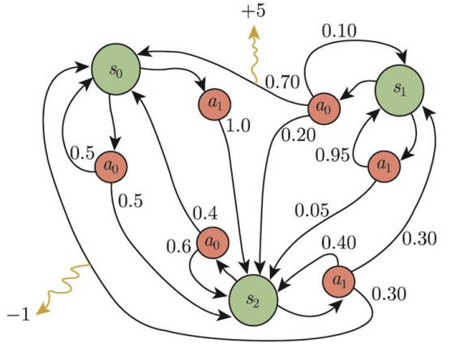

# RL_intro

## 1.简介

### 1.1概述

**处于一定环境，获取某种状态，输出某个动作，获得最大奖励。**

强化学习 (RL) 有两部分组成：智能体和环境；

其解决的问题是：智能体怎么在复杂，不确定的环境中最大化获得的奖励。

强化学习过程：

1. 智能体在环境中获取某个状态 s，利用该状态输出一个动作 action，也称为决策。
2. 环境根据其采取的动作，输出下一个状态以及该动作带来的奖励

#### 强化学习 VS 监督学习

**试错探索	延迟奖励	有时间关联的数据	稳定提升动作**

监督学习：有大量被标注的数据；输入的数据分布是独立同分布的。

强化学习：上面两个假设都不满足，其难点在于智能体不能得到即时的反馈，即延迟奖励 (delayed reward)，动作的好坏只有游戏结束后才知道。(以雅达利 (Atari) 为例)；

- 多数情况下处理的是序列数据

- 智能体获得能力的过程，其实是不断试错探索的 (trial-and-error exploration)。

  **探索和利用二者的权衡**

  **探索 (exploration)**：指尝试一些新动作，可能有好结果也可能什么也没有

  **利用 (exploitation)**：采取已知可获得最大奖励的动作并重复执行

- 无 supervisor ，只有延迟的奖励信号 (reward signal)

#### 强化学习的例子

如果说监督学习是为了获得人类的所能达到的能力，那么强化学习则将超越人类的表现。监督学习算法的上限 (upper bound) 是人类的表现 ，强化学习中的智能体则可获得超越人类能力的表现。

预演 (rollout): 从当前帧对动作进行采样，生成很多局游戏。

将当前的智能体与环境交互，得到一系列观测，每个观测可看成一条轨迹 (trajectory)，即当前帧及其采取的策略 (状态和动作)，一场游戏称为一个回合 (episode) 或者试验 (trial)。

#### 强化学习历史

早期的称为标准强化学习；目前深度强化学习 = 深度学习 + 强化学习；(类比于传统的CV和深度CV)。

将设计特征=>得到特征=>训练价值函数的过程变为端到端的过程 (end-to-end training)，省去了特征工程。

### 1.2序列决策

sequential decision making，RL 研究智能体于环境交互的问题，如何权衡 (trade-off) 近期奖励和远期奖励。

在于环境交互的过程中，智能体会获得很多观测。针对每个观测，智能体会采取一个动作，也会得到一个奖励，**即历史是观测，动作，奖励的序列。**

**完全可观测**：环境有自己的函数更新状态，智能体也有自己的函数更新状态。当智能体的状态和环境的状态等价的时候，称这个环境是完全可观测的 (fully observed)，此时 RL 建模为一个**马尔可夫决策过程** (MarKov decision process，MDP)，即此时的观测包含环境的所有状态。

**部分观测**：当智能体只能看到部分的观测时，强化学习通常建模为**部分可观测马尔可夫决策过程** (partially observable Markov decision process)。

部分观测的马尔可夫决策过程可以用一个七元组描述：(S，A，T，R，Ω，O，γ)

- S 表示状态空间
- A 表示动作空间
- T 为状态转移概率
- R 为奖励函数
- Ω 为观测概率
- O 为观测空间
- γ 为折扣因子

**动作空间**：有效动作的集合经常被称为动作空间 (action space)，进一步分为离散动作空间 (discrete action space) 和连续动作空间 (continuous action space)。

### 1.3智能体的组成和类型

具有如下一个或多个组成部分：

- 策略 (policy)：根据策略选取下一步的动作
- 价值函数 (value function)：价值函数对当前状态评估，其值越大表明进入这个状态越有利
- 模型 (model)：表示智能体对环境状态的理解

#### 策略

智能体的动作模型，决定智能体的动作。本质是一个函数，**将输入状态变为动作**。

可分为两种：

- 随机性策略 (stochastic policy)：**通常采用的方法**，输入一个状态，输出一个概率。此概率是智能体所有动作的概率，然后对这个概率分布进行采样，**得到智能体将采取的动作。**

- 确定性策略 (deterministic policy)：直接采用最有可能的动作

#### 价值函数

对未来奖励的预测，评估状态的好坏。其中含有折扣因子 (discount factor)。
$$
V_{\pi}(s) = E_{\pi}[G_t|s_t=s]\\
Q_{\pi}(s,a) = E_{\pi}[G_t|s_t=s, a_t=a]\\
$$

#### 模型

模型决定了下一步的状态，下一步的状态取决于**当前的状态及采取的动作**。

组成：

- 状态转移概率：
- 奖励函数：我们在当前状态采取的某个动作

**马尔可夫决策过程 = 策略 + 价值函数 + 模型三个组成部分**

#### 类型

基于价值的智能体 (value-based agent) 显示学习价值函数，隐式学习其策略，策略是从学习到的价值函数中推算出来的。

基于策略的智能体 (policy-based agent) 给一个状态，输出对应的概率，不体现学习价值函数。

二者结合形成演员-评论员智能体 (actor-critic agent)，通过学习策略函数和价值函数以及两者的交互得到最佳的动作。

